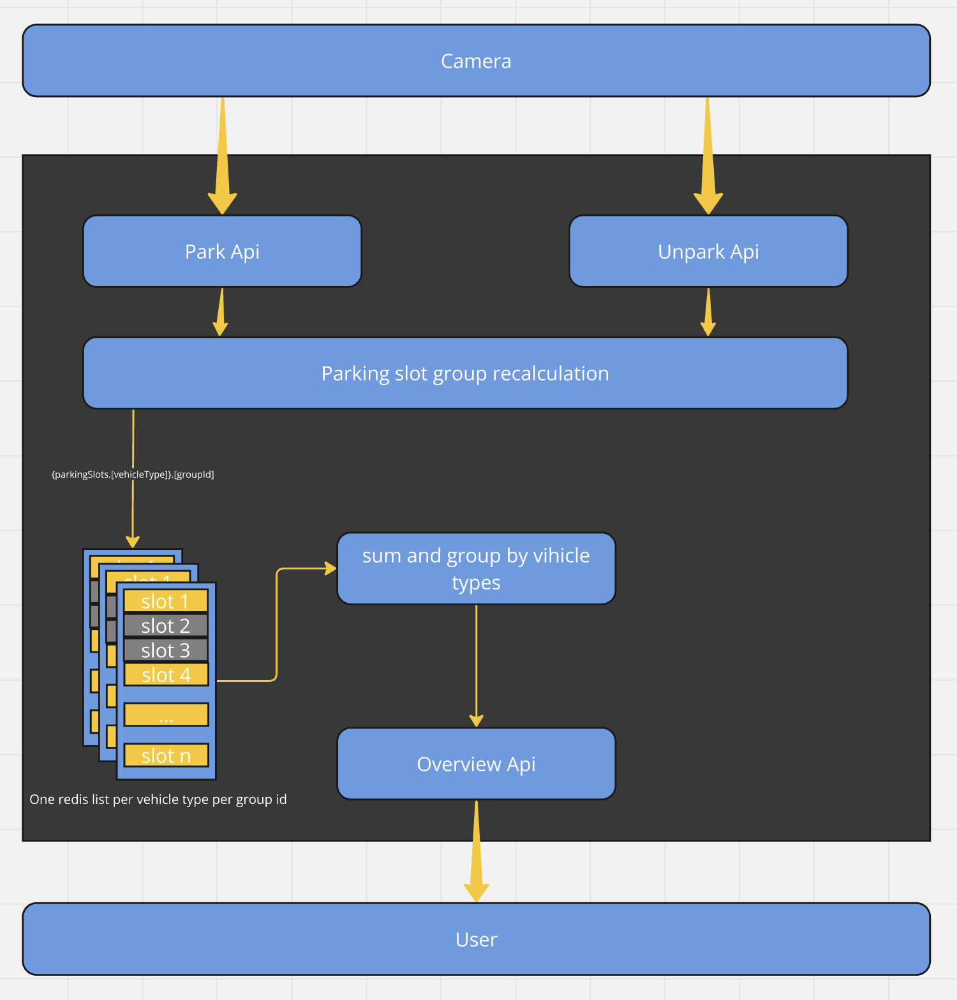

# Technical Interview Challenge 1

## Installation

1. Install docker compose https://docs.docker.com/compose/install/#scenario-one-install-docker-desktop
2. Clone the repository
2. Run `docker-compose up`
4. Run `docker-compose exec my-app composer install -o`
3. Run `docker-compose exec my-app php artisan migrate`
4. Load in browser http://localhost:8081

## Assumptions
1. The camera system only monitors one parking spot at a time, ie. each parking spot has its own camera system. Each camera is stateless and DO NOT talk to each other.
2. parking spot code are consecutively organized, each row of available parking spots are represented as a single group

## Design

### Parking slot groups
Parking slots are usually organized as a row, where if we want to park a van that takes 3 slots, it cannot be parked on the first and last slot if there are no available spaces, which brings complexity into the calculation. 

Having parking slots grouped together naturally solves this problem as a group of consecutively numbered slots has a clearly defined start and end boundary.

### Vehicle abstraction
Each vehicle type has two configuration abstractions:
- how many regular slots it will take
- is the vehicle eligible to park in a certain park slot type

These are in turn represented respectively by 
- config `parking.slot_size.motorcycle`, `parking.slot_size.car`, `parking.slot_size.van`
- each abstraction class's `canPark` method

Based on these two parameter, we can decide the available parking spots for a given type of vehicle within a group of parking slots.

### Code structure

 